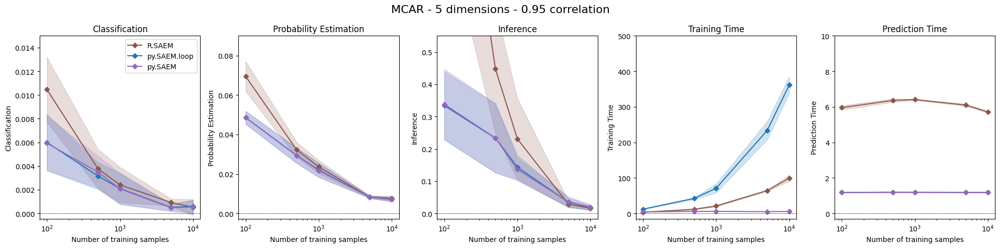
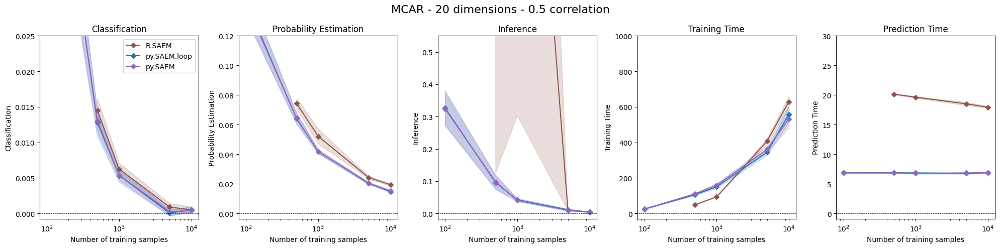

# Python Implementation of SAEM

### Implementation

SAEM is an iterative EM algorithm used for inference and prediction in logistic regression with missing values. It assumes normality in the covariates. The initial implementation by Wei Jiang, Julie Josse, and Marc Lavielle was in R ([github](https://github.com/wjiang94/misaem), [paper](https://hal.science/hal-01958835v1/file/JCGS-renvoyer.pdf)).

In addition to re-implementing SAEM in Python, we've introduced several improvements:

1. In the fitting and prediction processes, computations are vectorized per missing pattern.
2. In the prediction process, computations are vectorized per MCMC iteration.
3. The implementation inherits from scikit-learn, ensuring compatibility with a wide range of processing, evaluation, and other tools.


### Evaluation & Examples

First, we observe that thanks to the vectorization of computations, the training time becomes proportional to the number of patterns instead of the training sample size. The following figure shows that our implementation (*py.SAEM*) achieves similar or better performance than the original SAEM (*R.SAEM*) while being faster in both training and prediction. Our Python implementation of SAEM without vectorization (*py.SAEM.loop*) is, however, slower.




When the dimension increases, the number of patterns also increases, and the training time gains of *py.SAEM* diminish.



We also observe that our python implementation is more stable for smaller training size.

The inheritance from scikit-learn allows for seamless integration of SAEM into broader ML pipelines:


```
from sklearn.pipeline import Pipeline
from sklearn.preprocessing import StandardScaler
from sklearn.model_selection import cross_val_score
from sklearn.datasets import make_classification
import numpy as np

# 1. Create a synthetic dataset with missing values
X, y = make_classification(n_samples=200, n_features=10, random_state=42)
X[np.random.rand(*X.shape) < 0.1] = np.nan

# 2. Define the pipeline
pipeline = Pipeline([
    ('scaler', StandardScaler()),
    ('saem_model', MissGLM_parallel_fast(maxruns=1000, nmcmc=2))
])

# 3. Perform cross-validation
scores = cross_val_score(pipeline, X, y, cv=5, scoring='accuracy')

print(f"Cross-validation accuracy scores: {scores}")
print(f"Mean accuracy: {scores.mean():.3f} +/- {scores.std():.3f}")
```